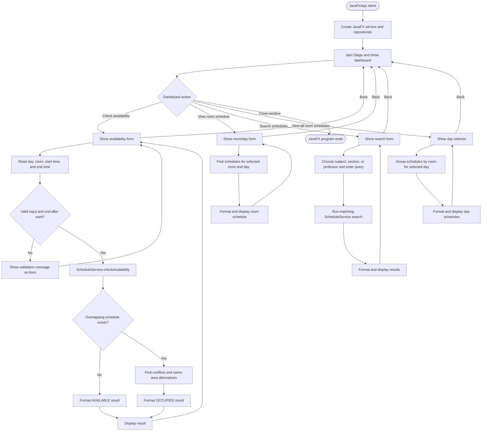
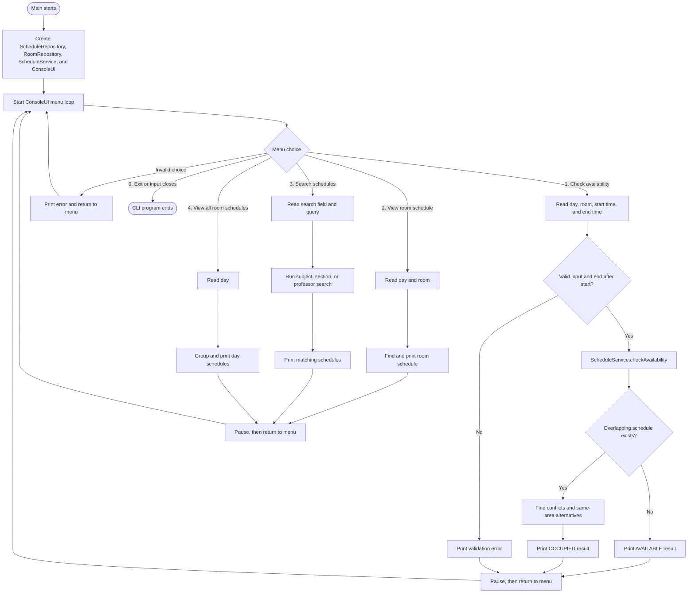

# Classroom Availability System

A Java Application project that is designed to check for room availability, providing alternative room suggestions, search reference for schedules, as well as viewing entire school schedule. This is a project aimed to fulfill the proposed project in Computer Programming by Sir Ace.

## Features

- Check whether a room is available during a requested time range.
- Show conflicting schedules and available alternative rooms.
- View the schedule for a selected room and day.
- Search schedules by subject, section, or professor.
- View all rooms that have schedules on a selected day.
- Load and validate schedule data from a CSV resource.
- Run automated tests for repository, service, CLI, and formatter behavior.

## Architecture

The application uses a lightweight layered architecture:

```text
JavaFX UI / CLI
        |
        v
ScheduleService
        |
        v
ScheduleRepository + RoomRepository
        |
        v
models and schedules.csv
```

### Model

The `model` package contains the application's data objects:

- `Schedule` represents one scheduled class.
- `Room` represents the room number and its building location.
- `AvailabilityResult` contains the availability status, conflicts, and alternatives.

### Repository

The `repository` package handles data access:

- `ScheduleRepository` loads and validates `schedules.csv` records.
- `RoomRepository` provides the known rooms and their locations.

> Note: Repositories does not handle any alteration or modification of the data but rather the access point of the records to be given to the service.

### Service

`ScheduleService` contains the scheduling rules used by both interfaces. It
handles room lookup, conflict detection, availability checks, alternative-room
searches, grouping, and schedule searches.

### User interfaces

- `JavaFxApp` creates the graphical screens and sends user actions to
  `ScheduleService`.
- `ConsoleUI` provides the command-line menu (Mostly used for manual testing & as a fallback option).
- `JavaFxFormatter` and the CLI formatting methods turn results into readable
  output.

The interfaces share the service and repository classes instead of having to rewrite a duplicated logic.

## Program flow

The JavaFX interface is the primary user interface. The CLI is intended mainly
for developer use, manual testing, and as a manually launched fallback when
the JavaFX interface cannot be loaded. The two launchers create their own UI
objects and service instances, but both use the same repository and service
logic.

### Primary flow: JavaFX interface



If JavaFX cannot be loaded, a developer can manually launch `Main` to use the
CLI. The CLI does not start automatically from `JavaFxApp`; it is a separate
entry point used for manual testing and fallback operation. It creates its own
`ScheduleRepository`, `RoomRepository`, `ScheduleService`, and `ConsoleUI`,
then runs a text-based menu loop:

### Developer and fallback flow: CLI



## Project structure

```text
src/
├── main/
│   ├── java/
│   │   ├── Main.java
│   │   ├── model/
│   │   ├── repository/
│   │   ├── service/
│   │   └── ui/
│   └── resources/
│       ├── schedules.csv
│       └── ui.css
└── test/
    ├── java/
    └── resources/
```

`Main.java` starts the CLI application. `JavaFxApp` is the JavaFX application
entry point. They are separate launchers, but both use the same service layer.

## Requirements

- Java 17 or newer
- Maven
- Linux or Windows for the configured JavaFX classifiers

## Running the application

### JavaFX interface

```bash
mvn javafx:run
```

### CLI interface

```bash
mvn compile exec:java
```

The CLI uses standard Java input/output and is platform-independent. Maven
selects the JavaFX classifier for the host platform on Linux or Windows.

## Running tests

```bash
mvn clean test
```

The tests cover CSV validation, scheduling behavior, CLI workflows, and
JavaFX output formatting without requiring a display.

## Platform-specific JavaFX builds

The Maven profile selects the JavaFX dependencies for the host platform:

```bash
mvn -DskipTests package
```

To select a platform explicitly, use one of:

```bash
mvn -Plinux -DskipTests package
mvn -Pwindows -DskipTests package
```

## GitHub Releases

Download the archive for the target operating system from the resulting GitHub
Release and extract it. Start the application using:

- Linux: `ClassroomAvailability/bin/ClassroomAvailability`
- Windows: `ClassroomAvailability\ClassroomAvailability.exe`

Each package also includes a CLI launcher for developer use, manual testing,
and fallback operation:

- Linux: `ClassroomAvailability/bin/ClassroomAvailabilityCLI`
- Windows: `ClassroomAvailability\ClassroomAvailabilityCLI.exe`

The Linux and Windows packages must be built separately because JavaFX includes
platform-specific native libraries.
